# Smart Traffic Light Management System

A Streamlit dashboard for controlling and monitoring a SUMO traffic-light simulation using a simple Q-learning reinforcement learning agent.

## Features

- Secure administrator login with `@moi.gov.sa` email validation.
- SUMO + TraCI simulation connection.
- Q-learning traffic-light control.
- Live dashboard for queue length, waiting time, reward, and current phase.
- Manual override and emergency mode.
- RL settings panel for learning rate, discount factor, exploration rate, and minimum green time.
- Clean modular code structure.

## Project Structure

```text
.
├── app.py                  # Main Streamlit interface
├── auth.py                 # Login, password hashing, and SQLite setup
├── config.py               # Paths and environment variables
├── rl_agent.py             # Q-learning agent logic
├── sumo_runner.py          # SUMO/TraCI simulation runner
├── sumo/                   # SUMO network, routes, detectors, and config files
├── assets/images/          # README screenshots
├── original_single_file.py # Backup of the original submitted file
├── requirements.txt
└── .gitignore
```

## Screenshots

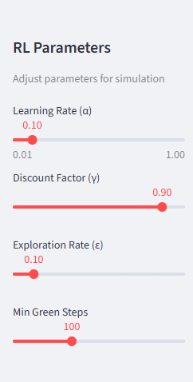
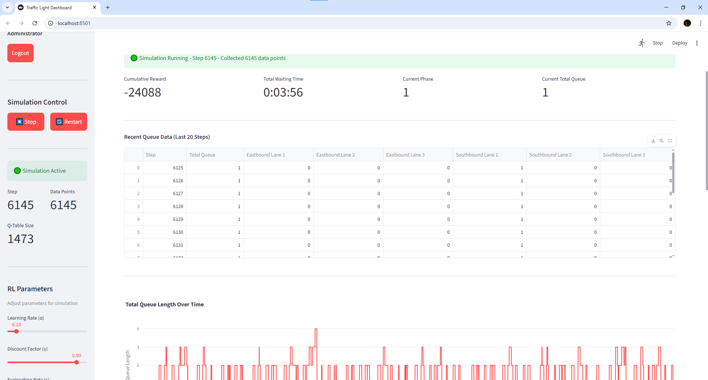
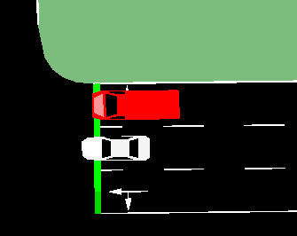


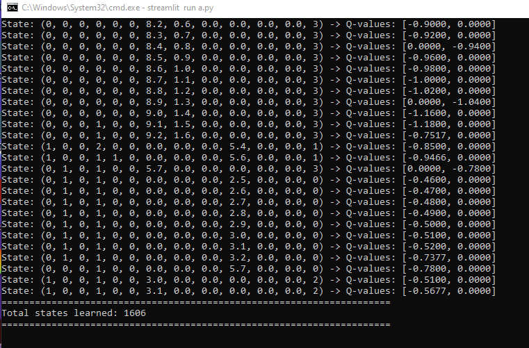
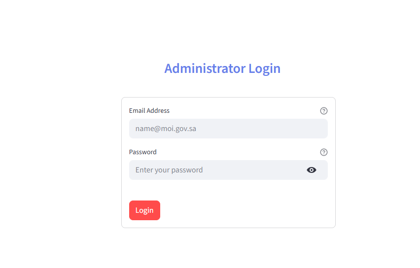
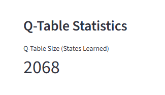
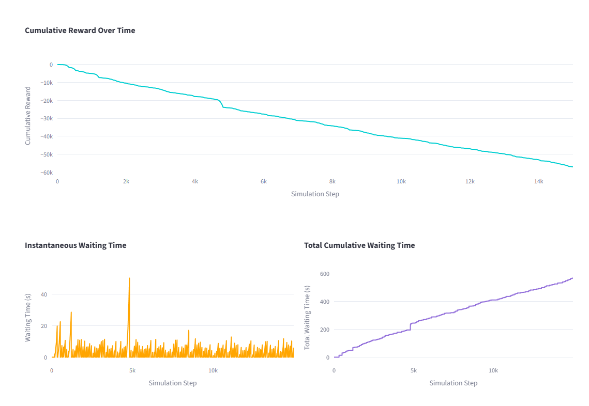
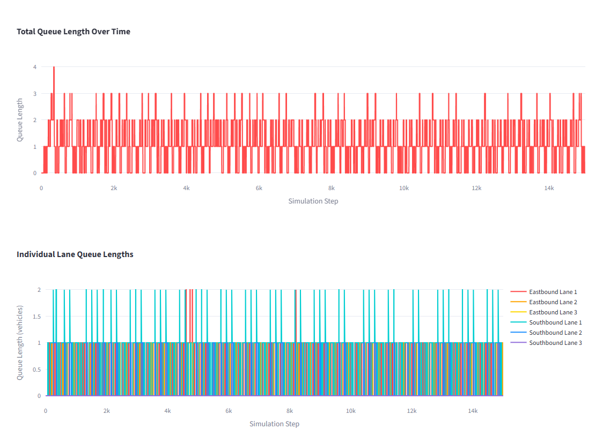
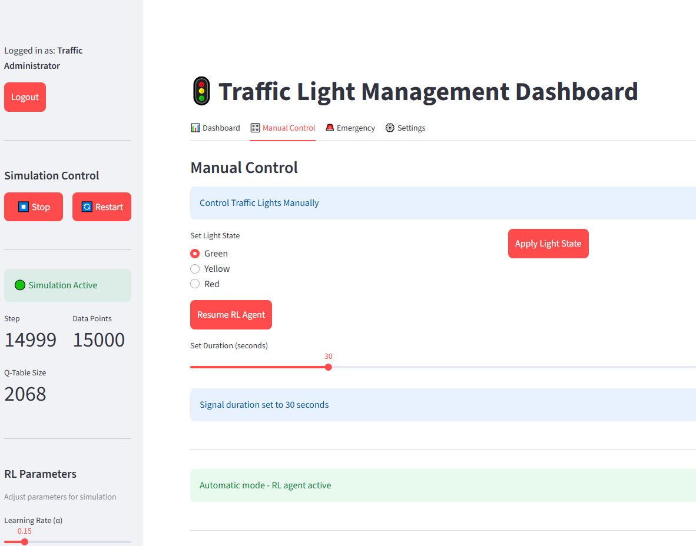
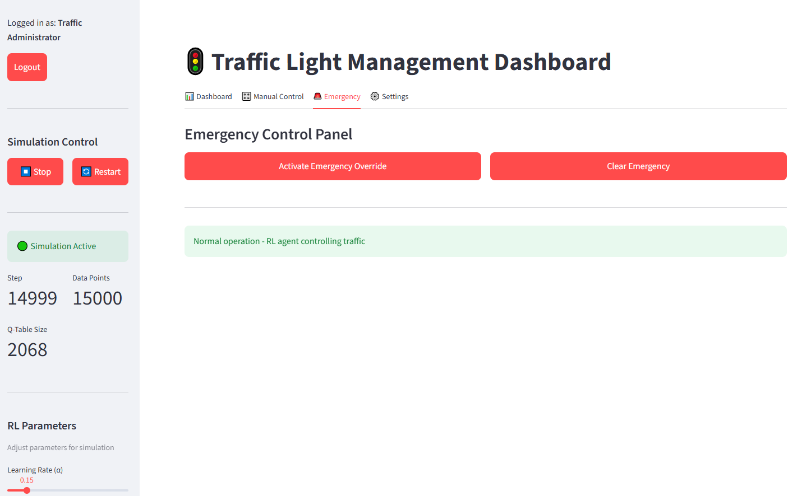
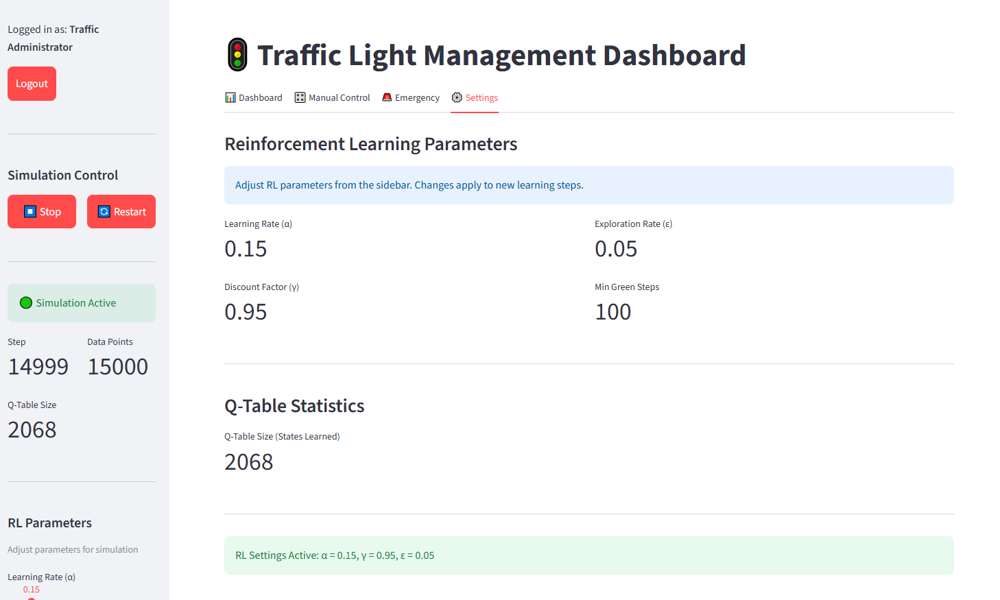
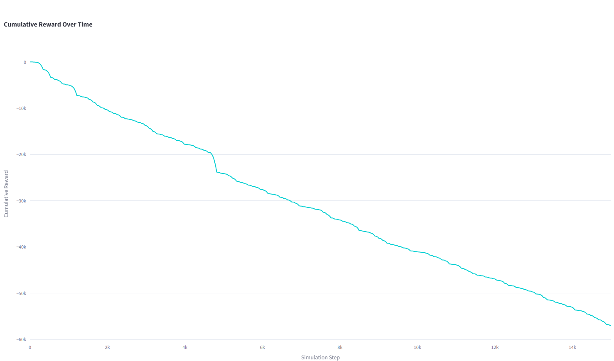
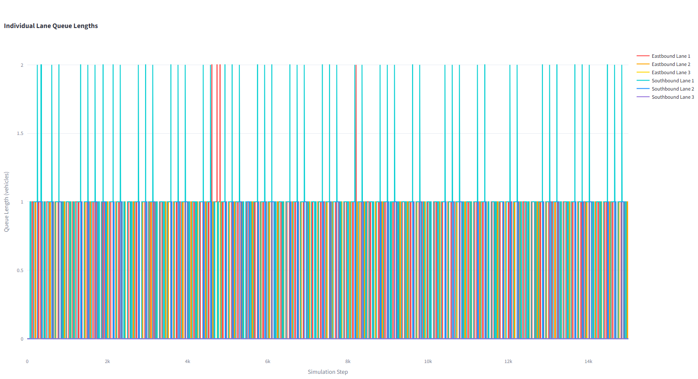

## How to Run

### 1. Install Python packages

```bash
pip install -r requirements.txt
```

### 2. Install SUMO

Install SUMO on your device and set the `SUMO_HOME` environment variable.

On macOS, it may look like this:

```bash
export SUMO_HOME=/opt/homebrew/opt/sumo/share/sumo
```

### 3. Optional: set admin login details

The first admin account is created automatically when `traffic_system.db` does not exist.
For a public GitHub repo, change the password before running:

```bash
export ADMIN_EMAIL=traffic@moi.gov.sa
export ADMIN_PASSWORD=YourStrongPassword
export ADMIN_NAME="Traffic Administrator"
```

### 4. Run the app

```bash
streamlit run app.py
```

## Notes

- `traffic_system.db` is ignored by Git because it is generated locally.
- The original single-file version is kept as `original_single_file.py` for backup.
- The modular version uses `sumo/RL.sumocfg` by default. To use a different config file, set `SUMO_CONFIG_PATH`.
